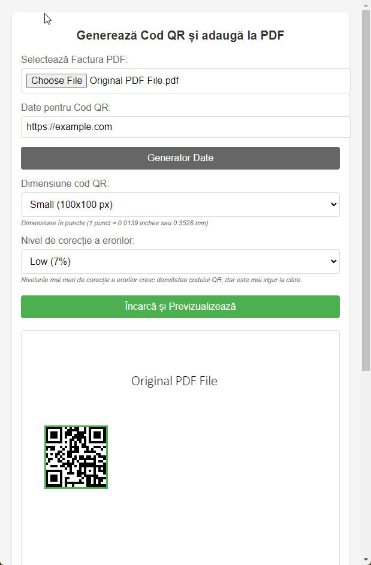
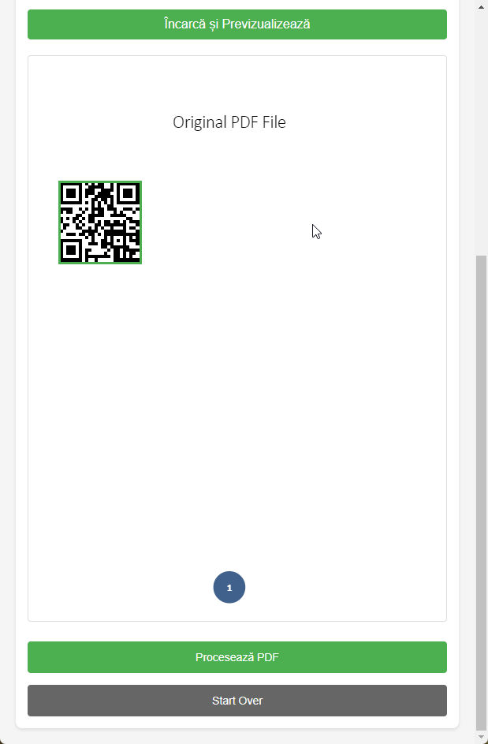

# QR PDF
Generate a QR Code from text, place it over a PDF file and save the new PDF file.

## Demo
https://romfast.github.io/qrpdf/

## Instalation
Copy index.html, script.js (_generator.html and generator.js are optional_)

You can execute index.html locally or on a web server.

**generator.html** generates a coded text for the Romanian government photovoltaic panel installation program. (_it is not required_)

## Use
1. Choose a PDF file
2. Enter a text for the QR Code
3. Choose QR Code options (size, error correction level)
4. Press "Load and Preview" button
5. Place the QR Code on the PDF Preview
6. Press "Process PDF" button to download the new PDF with the QR Code

